# MediSense AI — Catalogue des Diagrammes de Conception
**Rapport PFE 2025-2026 | Abderrahim Boussyf | EMSI Marrakech | n.synergy**

> Tous les diagrammes sont en syntaxe **Mermaid** — rendus automatiquement sur GitHub, VS Code (extension Mermaid Preview) et exportables en PNG/SVG via [mermaid.live](https://mermaid.live).

---

## Table des Matières

1. [Architecture Générale](#1-architecture-générale)
   - 1.1 Vue d'ensemble des 3 Pipelines IA
   - 1.2 Infrastructure de Déploiement Docker
   - 1.3 Architecture Applicative — Composants Backend

2. [Diagrammes de Cas d'Utilisation](#2-diagrammes-de-cas-dutilisation)
   - 2.1 Cas d'utilisation Global (tous acteurs)
   - 2.2 Sprint 1 — Fondation & Authentification
   - 2.3 Sprint 2 — RGPD & Consentement
   - 2.4 Sprint 3 — RAG / LLM Chatbot
   - 2.5 Sprint 4 — Agents IA & DPA
   - 2.6 Sprint 5 — ML Prédictif No-Show
   - 2.7 Sprint 6 — Salesforce & MLOps
   - 2.8 Sprint 7 — IoT / Détection d'Anomalie
   - 2.9 Sprint 8 — Intégration & Production

3. [Modèle de Données](#3-modèle-de-données)
   - 3.1 Diagramme de Classes (ORM)
   - 3.2 Diagramme Entité-Relation (ERD)

4. [Diagrammes de Séquence](#4-diagrammes-de-séquence)
   - 4.1 Connexion — POST /auth/login
   - 4.2 Requête Protégée — Bearer Token + RBAC
   - 4.3 Déconnexion — POST /auth/logout
   - 4.4 Renouvellement — POST /auth/refresh
   - 4.5 Pipeline RAG — Chatbot Médical
   - 4.6 Pipeline IoT — Détection d'Anomalie LSTM
   - 4.7 Pipeline ML — Prédiction No-Show
   - 4.8 RGPD — Gestion du Consentement et Export

5. [Flux Métier](#5-flux-métier)
   - 5.1 Parcours Patient Complet — 24 heures
   - 5.2 Flux de Consultation Médicale Augmentée
   - 5.3 Pipeline MLOps — Réentraînement Automatique

6. [Architecture des Pipelines IA](#6-architecture-des-pipelines-ia)
   - 6.1 Pipeline 1 — IoT & LSTM Bidirectionnel
   - 6.2 Pipeline 2 — RAG & Mistral 7B Instruct
   - 6.3 Pipeline 3 — XGBoost No-Show
   - 6.4 Intégration CRM Salesforce

7. [Sécurité & RGPD](#7-sécurité--rgpd)
   - 7.1 Architecture de Sécurité par Couches
   - 7.2 Modèle RBAC — Contrôle d'Accès par Rôle
   - 7.3 Privacy by Design — Flux RGPD

---

## 1. Architecture Générale

### 1.1 Vue d'ensemble des 3 Pipelines IA

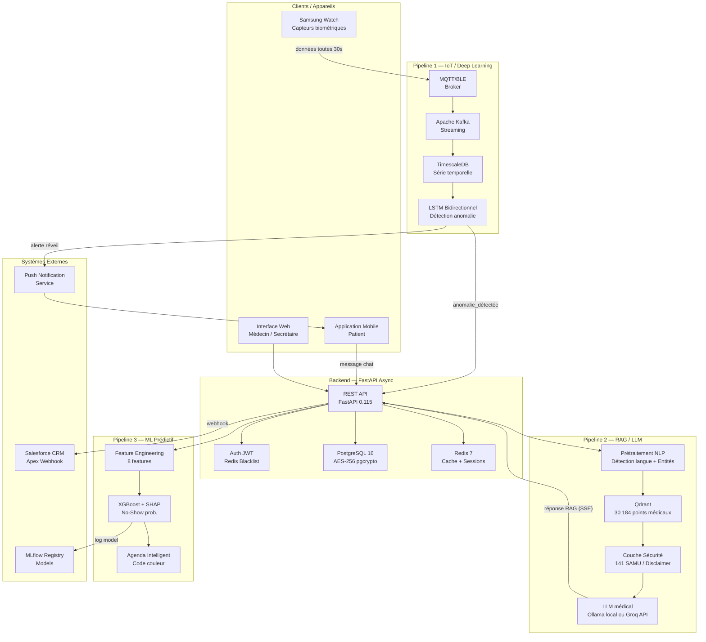
```mermaid
flowchart TB
    subgraph Clients["Clients / Appareils"]
        WATCH["Samsung Watch<br/>Capteurs biométriques"]
        APP["Application Mobile<br/>Patient"]
        WEB["Interface Web<br/>Médecin / Secrétaire"]
    end

    subgraph P1["Pipeline 1 — IoT / Deep Learning"]
        direction LR
        MQTT["MQTT/BLE<br/>Broker"]
        KAFKA["Apache Kafka<br/>Streaming"]
        TS["TimescaleDB<br/>Série temporelle"]
        LSTM["LSTM Bidirectionnel<br/>Détection anomalie"]
    end

    subgraph P2["Pipeline 2 — RAG / LLM"]
        direction LR
        NLP["Prétraitement NLP<br/>Détection langue + Entités"]
        QDRANT["Qdrant<br/>30 184 points médicaux"]
        SAFETY["Couche Sécurité<br/>141 SAMU / Disclaimer"]
        LLAMA["LLM médical<br/>Ollama local ou Groq API"]
    end

    subgraph P3["Pipeline 3 — ML Prédictif"]
        direction LR
        FE["Feature Engineering<br/>8 features"]
        XGB["XGBoost + SHAP<br/>No-Show prob."]
        AGENDA["Agenda Intelligent<br/>Code couleur"]
    end

    subgraph Backend["Backend — FastAPI Async"]
        API["REST API<br/>FastAPI 0.115"]
        AUTH["Auth JWT<br/>Redis Blacklist"]
        DB["PostgreSQL 16<br/>AES-256 pgcrypto"]
        REDIS["Redis 7<br/>Cache + Sessions"]
    end

    subgraph Externe["Systèmes Externes"]
        SF["Salesforce CRM<br/>Apex Webhook"]
        PUSH["Push Notification<br/>Service"]
        MLFLOW["MLflow Registry<br/>Models"]
    end

    WATCH -->|"données toutes 30s"| MQTT
    MQTT --> KAFKA --> TS --> LSTM
    LSTM -->|"anomalie_détectée"| API
    LSTM -->|"alerte réveil"| PUSH
    PUSH --> APP

    APP -->|"message chat"| API
    API --> NLP --> QDRANT --> SAFETY --> LLAMA
    LLAMA -->|"réponse RAG (SSE)"| API

    WEB --> API
    API --> FE --> XGB --> AGENDA
    API --> AUTH
    API --> DB
    API --> REDIS
    API -->|"webhook"| SF
    XGB -->|"log model"| MLFLOW
```

---

### 1.2 Infrastructure de Déploiement Docker

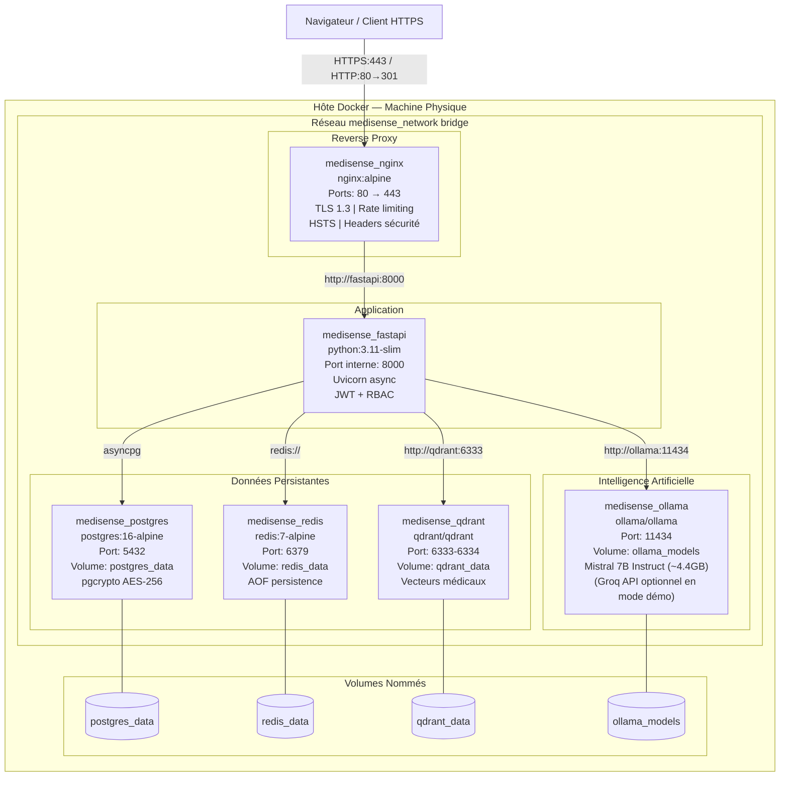
```mermaid
flowchart TB
    INTERNET["Navigateur / Client HTTPS"]

    subgraph HOST["Hôte Docker — Machine Physique"]
        subgraph NET["Réseau medisense_network bridge"]

            subgraph PROXY["Reverse Proxy"]
                NGINX["medisense_nginx<br/>nginx:alpine<br/>Ports: 80 → 443<br/>TLS 1.3 | Rate limiting<br/>HSTS | Headers sécurité"]
            end

            subgraph APP["Application"]
                FASTAPI["medisense_fastapi<br/>python:3.11-slim<br/>Port interne: 8000<br/>Uvicorn async<br/>JWT + RBAC"]
            end

            subgraph DATA["Données Persistantes"]
                PG["medisense_postgres<br/>postgres:16-alpine<br/>Port: 5432<br/>Volume: postgres_data<br/>pgcrypto AES-256"]
                REDIS_C["medisense_redis<br/>redis:7-alpine<br/>Port: 6379<br/>Volume: redis_data<br/>AOF persistence"]
                QDRANT_C["medisense_qdrant<br/>qdrant/qdrant<br/>Port: 6333-6334<br/>Volume: qdrant_data<br/>Vecteurs médicaux"]
            end

            subgraph AI["Intelligence Artificielle"]
                OLLAMA_C["medisense_ollama<br/>ollama/ollama<br/>Port: 11434<br/>Volume: ollama_models<br/>Mistral 7B Instruct (~4.4GB)<br/>(Groq API optionnel en mode démo)"]
            end
        end

        subgraph VOLS["Volumes Nommés"]
            V1[("postgres_data")]
            V2[("redis_data")]
            V3[("qdrant_data")]
            V4[("ollama_models")]
        end
    end

    INTERNET -->|"HTTPS:443 / HTTP:80→301"| NGINX
    NGINX -->|"http://fastapi:8000"| FASTAPI
    FASTAPI -->|"asyncpg"| PG
    FASTAPI -->|"redis://"| REDIS_C
    FASTAPI -->|"http://qdrant:6333"| QDRANT_C
    FASTAPI -->|"http://ollama:11434"| OLLAMA_C

    PG --- V1
    REDIS_C --- V2
    QDRANT_C --- V3
    OLLAMA_C --- V4
```

---

### 1.3 Architecture Applicative — Composants Backend

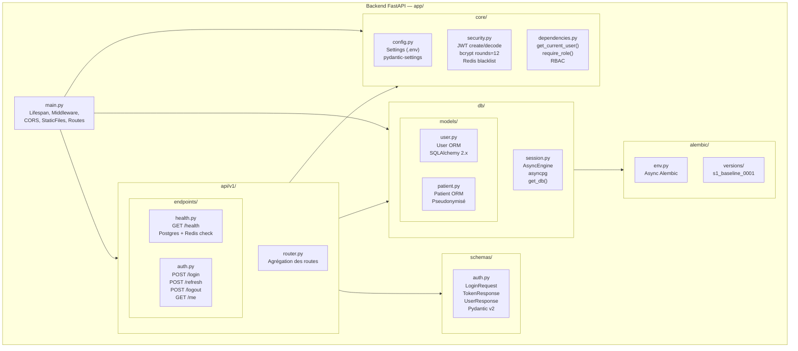
```mermaid
flowchart TB
    subgraph FastAPI["Backend FastAPI — app/"]
        MAIN["main.py<br/>Lifespan, Middleware,<br/>CORS, StaticFiles, Routes"]

        subgraph CORE["core/"]
            CONFIG["config.py<br/>Settings (.env)<br/>pydantic-settings"]
            SECURITY["security.py<br/>JWT create/decode<br/>bcrypt rounds=12<br/>Redis blacklist"]
            DEPS["dependencies.py<br/>get_current_user()<br/>require_role()<br/>RBAC"]
        end

        subgraph API["api/v1/"]
            ROUTER["router.py<br/>Agrégation des routes"]
            subgraph ENDPOINTS["endpoints/"]
                HEALTH["health.py<br/>GET /health<br/>Postgres + Redis check"]
                AUTH_EP["auth.py<br/>POST /login<br/>POST /refresh<br/>POST /logout<br/>GET /me"]
            end
        end

        subgraph DB["db/"]
            SESSION["session.py<br/>AsyncEngine<br/>asyncpg<br/>get_db()"]
            subgraph MODELS["models/"]
                USER_M["user.py<br/>User ORM<br/>SQLAlchemy 2.x"]
                PATIENT_M["patient.py<br/>Patient ORM<br/>Pseudonymisé"]
            end
        end

        subgraph SCHEMAS["schemas/"]
            AUTH_S["auth.py<br/>LoginRequest<br/>TokenResponse<br/>UserResponse<br/>Pydantic v2"]
        end

        subgraph ALEMBIC["alembic/"]
            ENV["env.py<br/>Async Alembic"]
            VERSIONS["versions/<br/>s1_baseline_0001"]
        end
    end

    MAIN --> CORE & API & DB
    API --> CORE
    API --> DB
    API --> SCHEMAS
    DB --> ALEMBIC
```

---

## 2. Diagrammes de Cas d'Utilisation

### 2.1 Cas d'utilisation Global

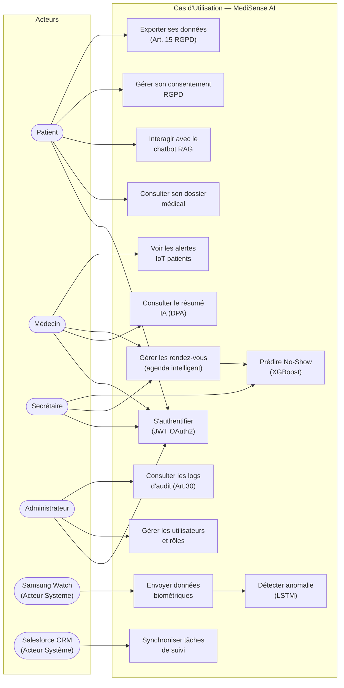
```mermaid
flowchart LR
    subgraph Acteurs["Acteurs"]
        PATIENT(["Patient"])
        DOCTOR(["Médecin"])
        SECRETARY(["Secrétaire"])
        ADMIN(["Administrateur"])
        WATCH(["Samsung Watch<br/>(Acteur Système)"])
        SF_ACT(["Salesforce CRM<br/>(Acteur Système)"])
    end

    subgraph UC["Cas d'Utilisation — MediSense AI"]
        UC1["S'authentifier<br/>(JWT OAuth2)"]
        UC2["Consulter son dossier<br/>médical"]
        UC3["Interagir avec le<br/>chatbot RAG"]
        UC4["Gérer son consentement<br/>RGPD"]
        UC5["Exporter ses données<br/>(Art. 15 RGPD)"]
        UC6["Consulter le résumé<br/>IA (DPA)"]
        UC7["Gérer les rendez-vous<br/>(agenda intelligent)"]
        UC8["Voir les alertes<br/>IoT patients"]
        UC9["Gérer les utilisateurs<br/>et rôles"]
        UC10["Consulter les logs<br/>d'audit (Art.30)"]
        UC11["Envoyer données<br/>biométriques"]
        UC12["Synchroniser tâches<br/>de suivi"]
        UC13["Prédire No-Show<br/>(XGBoost)"]
        UC14["Détecter anomalie<br/>(LSTM)"]
    end

    PATIENT --> UC1 & UC2 & UC3 & UC4 & UC5
    DOCTOR --> UC1 & UC6 & UC7 & UC8
    SECRETARY --> UC1 & UC7 & UC13
    ADMIN --> UC1 & UC9 & UC10
    WATCH --> UC11 --> UC14
    SF_ACT --> UC12
    UC7 --> UC13
```

---

### 2.2 Sprint 1 — Fondation & Authentification

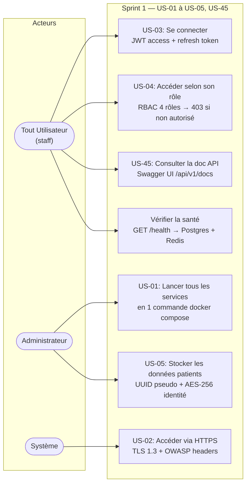
```mermaid
flowchart LR
    subgraph A["Acteurs"]
        ANY(["Tout Utilisateur<br/>(staff)"])
        ADMIN(["Administrateur"])
        SYS(["Système"])
    end

    subgraph UC["Sprint 1 — US-01 à US-05, US-45"]
        UC1["US-01: Lancer tous les services<br/>en 1 commande docker compose"]
        UC2["US-02: Accéder via HTTPS<br/>TLS 1.3 + OWASP headers"]
        UC3["US-03: Se connecter<br/>JWT access + refresh token"]
        UC4["US-04: Accéder selon son rôle<br/>RBAC 4 rôles → 403 si non autorisé"]
        UC5["US-05: Stocker les données patients<br/>UUID pseudo + AES-256 identité"]
        UC45["US-45: Consulter la doc API<br/>Swagger UI /api/v1/docs"]
        HEALTH["Vérifier la santé<br/>GET /health → Postgres + Redis"]
    end

    ANY --> UC3 & UC4 & UC45 & HEALTH
    ADMIN --> UC1 & UC5
    SYS --> UC2
```

---

### 2.3 Sprint 2 — RGPD & Consentement

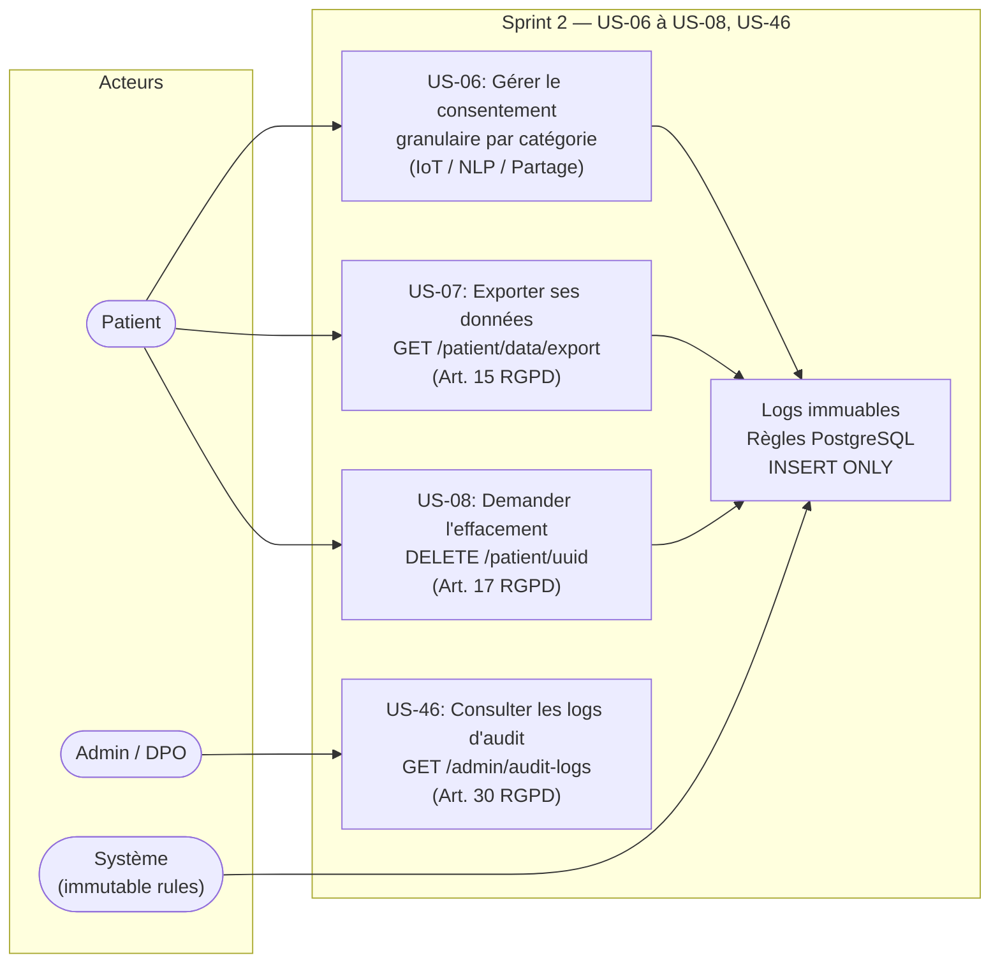
```mermaid
flowchart LR
    subgraph A["Acteurs"]
        PATIENT(["Patient"])
        ADMIN(["Admin / DPO"])
        SYS(["Système<br/>(immutable rules)"])
    end

    subgraph UC["Sprint 2 — US-06 à US-08, US-46"]
        UC6["US-06: Gérer le consentement<br/>granulaire par catégorie<br/>(IoT / NLP / Partage)"]
        UC7["US-07: Exporter ses données<br/>GET /patient/data/export<br/>(Art. 15 RGPD)"]
        UC8["US-08: Demander l'effacement<br/>DELETE /patient/uuid<br/>(Art. 17 RGPD)"]
        UC46["US-46: Consulter les logs d'audit<br/>GET /admin/audit-logs<br/>(Art. 30 RGPD)"]
        IMMUT["Logs immuables<br/>Règles PostgreSQL<br/>INSERT ONLY"]
    end

    PATIENT --> UC6 & UC7 & UC8
    ADMIN --> UC46
    SYS --> IMMUT
    UC6 & UC7 & UC8 --> IMMUT
```

---

### 2.4 Sprint 3 — RAG / LLM Chatbot

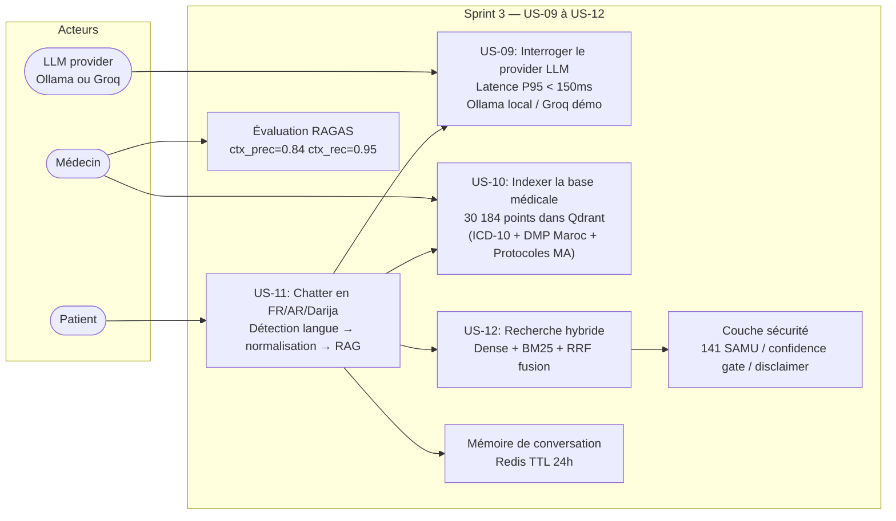
```mermaid
flowchart LR
    subgraph A["Acteurs"]
        PATIENT(["Patient"])
        DOCTOR(["Médecin"])
        SYS(["LLM provider<br/>Ollama ou Groq"])
    end

    subgraph UC["Sprint 3 — US-09 à US-12"]
        UC9["US-09: Interroger le provider LLM<br/>Latence P95 < 150ms<br/>Ollama local / Groq démo"]
        UC10["US-10: Indexer la base médicale<br/>30 184 points dans Qdrant<br/>(ICD-10 + DMP Maroc + Protocoles MA)"]
        UC11["US-11: Chatter en FR/AR/Darija<br/>Détection langue → normalisation → RAG"]
        UC12["US-12: Recherche hybride<br/>Dense + BM25 + RRF fusion"]
        SAFE["Couche sécurité<br/>141 SAMU / confidence gate / disclaimer"]
        EVAL["Évaluation RAGAS<br/>ctx_prec=0.84 ctx_rec=0.95"]
        MEM["Mémoire de conversation<br/>Redis TTL 24h"]
    end

    PATIENT --> UC11
    UC11 --> UC9 & UC10 & UC12
    UC12 --> SAFE
    SYS --> UC9
    UC11 --> MEM
    DOCTOR --> UC10 & EVAL
```

---

### 2.5 Sprint 4 — Agents IA & DPA

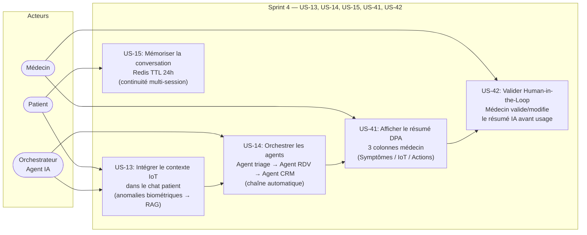
```mermaid
flowchart LR
    subgraph A["Acteurs"]
        PATIENT(["Patient"])
        DOCTOR(["Médecin"])
        SYS(["Orchestrateur<br/>Agent IA"])
    end

    subgraph UC["Sprint 4 — US-13, US-14, US-15, US-41, US-42"]
        UC13["US-13: Intégrer le contexte IoT<br/>dans le chat patient<br/>(anomalies biométriques → RAG)"]
        UC14["US-14: Orchestrer les agents<br/>Agent triage → Agent RDV → Agent CRM<br/>(chaîne automatique)"]
        UC15["US-15: Mémoriser la conversation<br/>Redis TTL 24h<br/>(continuité multi-session)"]
        UC41["US-41: Afficher le résumé DPA<br/>3 colonnes médecin<br/>(Symptômes / IoT / Actions)"]
        UC42["US-42: Valider Human-in-the-Loop<br/>Médecin valide/modifie<br/>le résumé IA avant usage"]
    end

    PATIENT --> UC13 & UC15
    DOCTOR --> UC41 & UC42
    SYS --> UC13 & UC14
    UC13 --> UC14
    UC14 --> UC41
    UC41 --> UC42
```

---

### 2.6 Sprint 5 — ML Prédictif No-Show

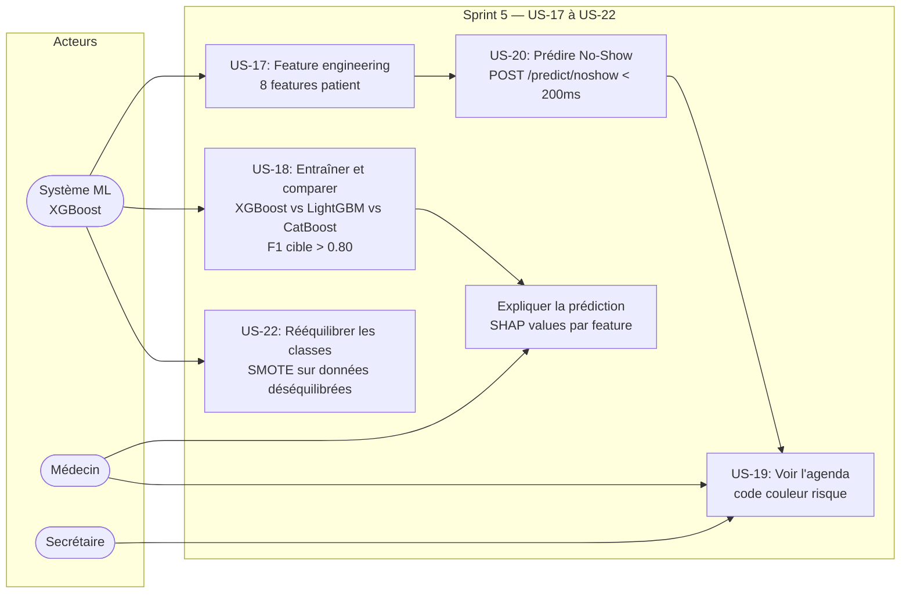
```mermaid
flowchart LR
    subgraph A["Acteurs"]
        SECRETARY(["Secrétaire"])
        DOCTOR(["Médecin"])
        SYS(["Système ML<br/>XGBoost"])
    end

    subgraph UC["Sprint 5 — US-17 à US-22"]
        UC17["US-17: Feature engineering<br/>8 features patient"]
        UC18["US-18: Entraîner et comparer<br/>XGBoost vs LightGBM vs CatBoost<br/>F1 cible > 0.80"]
        UC19["US-19: Voir l'agenda<br/>code couleur risque"]
        UC20["US-20: Prédire No-Show<br/>POST /predict/noshow < 200ms"]
        UC22["US-22: Rééquilibrer les classes<br/>SMOTE sur données déséquilibrées"]
        SHAP["Expliquer la prédiction<br/>SHAP values par feature"]
    end

    SECRETARY --> UC19
    DOCTOR --> UC19 & SHAP
    SYS --> UC17 & UC18 & UC22
    UC17 --> UC20
    UC20 --> UC19
    UC18 --> SHAP
```

---

### 2.7 Sprint 6 — Salesforce & MLOps

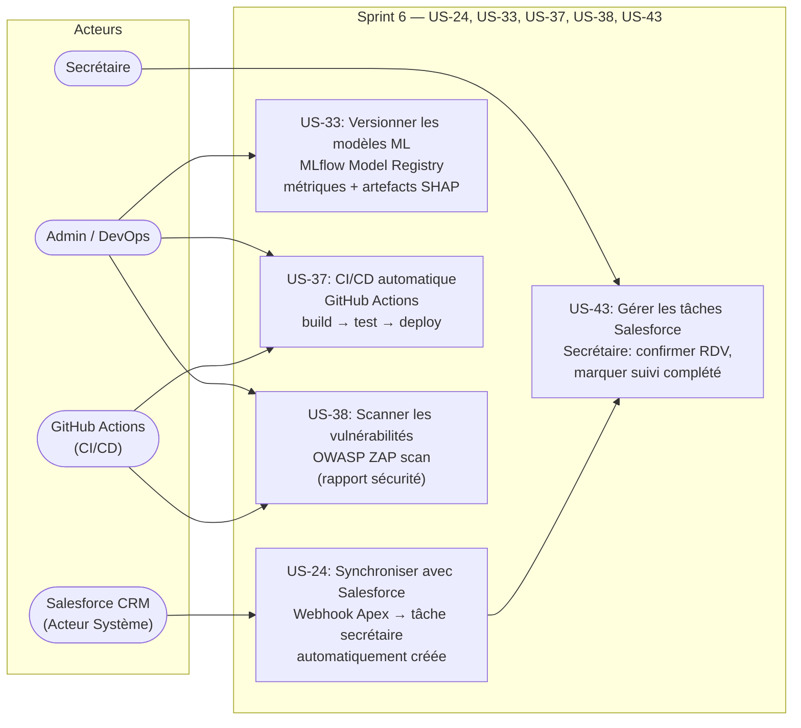
```mermaid
flowchart LR
    subgraph A["Acteurs"]
        SECRETARY(["Secrétaire"])
        ADMIN(["Admin / DevOps"])
        SF_ACT(["Salesforce CRM<br/>(Acteur Système)"])
        GH(["GitHub Actions<br/>(CI/CD)"])
    end

    subgraph UC["Sprint 6 — US-24, US-33, US-37, US-38, US-43"]
        UC24["US-24: Synchroniser avec Salesforce<br/>Webhook Apex → tâche secrétaire<br/>automatiquement créée"]
        UC33["US-33: Versionner les modèles ML<br/>MLflow Model Registry<br/>métriques + artefacts SHAP"]
        UC37["US-37: CI/CD automatique<br/>GitHub Actions<br/>build → test → deploy"]
        UC38["US-38: Scanner les vulnérabilités<br/>OWASP ZAP scan<br/>(rapport sécurité)"]
        UC43["US-43: Gérer les tâches Salesforce<br/>Secrétaire: confirmer RDV,<br/>marquer suivi complété"]
    end

    SECRETARY --> UC43
    ADMIN --> UC33 & UC37 & UC38
    SF_ACT --> UC24 --> UC43
    GH --> UC37 & UC38
```

---

### 2.8 Sprint 7 — IoT / Détection d'Anomalie

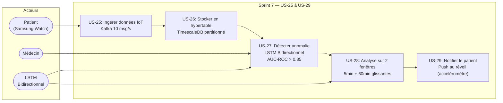
```mermaid
flowchart LR
    subgraph A["Acteurs"]
        PATIENT(["Patient<br/>(Samsung Watch)"])
        DOCTOR(["Médecin"])
        SYS(["LSTM<br/>Bidirectionnel"])
    end

    subgraph UC["Sprint 7 — US-25 à US-29"]
        UC25["US-25: Ingérer données IoT<br/>Kafka 10 msg/s"]
        UC26["US-26: Stocker en hypertable<br/>TimescaleDB partitionné"]
        UC27["US-27: Détecter anomalie<br/>LSTM Bidirectionnel<br/>AUC-ROC > 0.85"]
        UC28["US-28: Analyse sur 2 fenêtres<br/>5min + 60min glissantes"]
        UC29["US-29: Notifier le patient<br/>Push au réveil (accéléromètre)"]
    end

    PATIENT --> UC25
    UC25 --> UC26 --> UC27
    UC27 --> UC28
    UC28 --> UC29
    SYS --> UC27 & UC28
    DOCTOR --> UC27
```

---

### 2.9 Sprint 8 — Intégration & Production

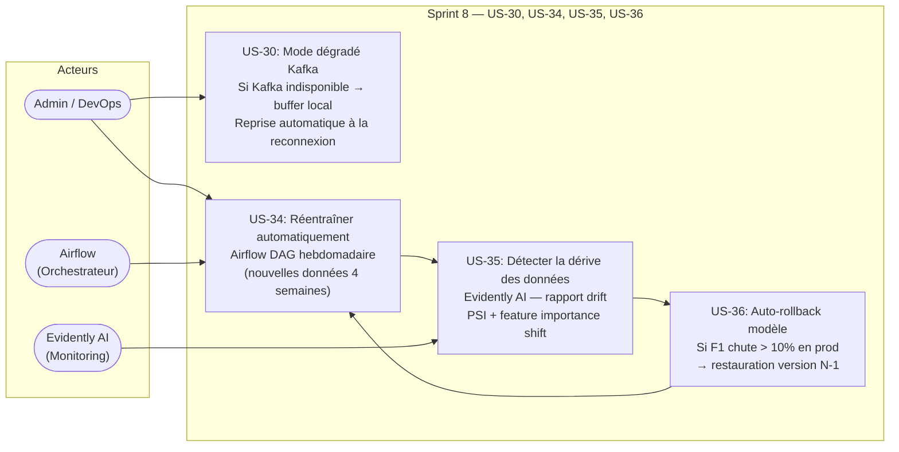
```mermaid
flowchart LR
    subgraph A["Acteurs"]
        ADMIN(["Admin / DevOps"])
        SYS(["Airflow<br/>(Orchestrateur)"])
        EVID_ACT(["Evidently AI<br/>(Monitoring)"])
    end

    subgraph UC["Sprint 8 — US-30, US-34, US-35, US-36"]
        UC30["US-30: Mode dégradé Kafka<br/>Si Kafka indisponible → buffer local<br/>Reprise automatique à la reconnexion"]
        UC34["US-34: Réentraîner automatiquement<br/>Airflow DAG hebdomadaire<br/>(nouvelles données 4 semaines)"]
        UC35["US-35: Détecter la dérive des données<br/>Evidently AI — rapport drift<br/>PSI + feature importance shift"]
        UC36["US-36: Auto-rollback modèle<br/>Si F1 chute > 10% en prod<br/>→ restauration version N-1"]
    end

    ADMIN --> UC30 & UC34
    SYS --> UC34 --> UC35
    EVID_ACT --> UC35 --> UC36
    UC36 --> UC34
```

---

## 3. Modèle de Données

### 3.1 Diagramme de Classes

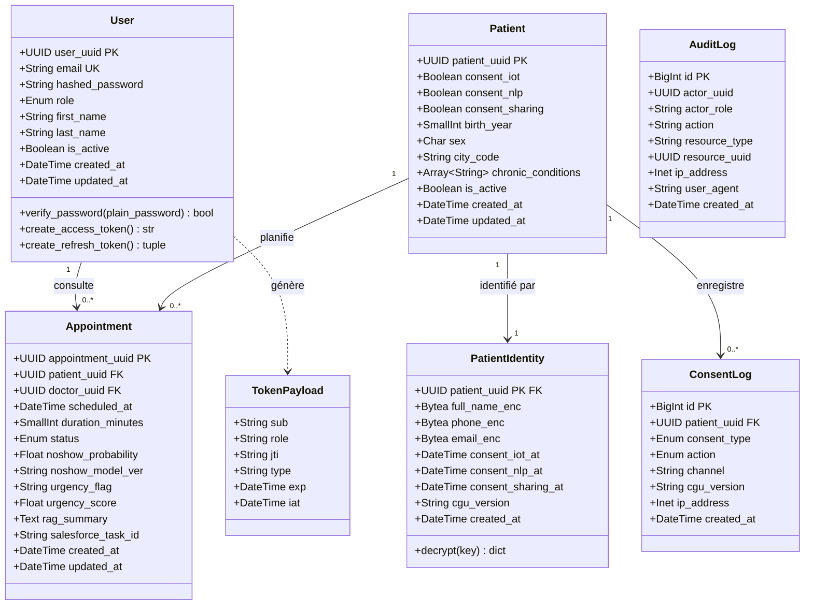
```mermaid
classDiagram
    class User {
        +UUID user_uuid PK
        +String email UK
        +String hashed_password
        +Enum role
        +String first_name
        +String last_name
        +Boolean is_active
        +DateTime created_at
        +DateTime updated_at
        +verify_password(plain_password) bool
        +create_access_token() str
        +create_refresh_token() tuple
    }

    class Patient {
        +UUID patient_uuid PK
        +Boolean consent_iot
        +Boolean consent_nlp
        +Boolean consent_sharing
        +SmallInt birth_year
        +Char sex
        +String city_code
        +Array~String~ chronic_conditions
        +Boolean is_active
        +DateTime created_at
        +DateTime updated_at
    }

    class PatientIdentity {
        +UUID patient_uuid PK FK
        +Bytea full_name_enc
        +Bytea phone_enc
        +Bytea email_enc
        +DateTime consent_iot_at
        +DateTime consent_nlp_at
        +DateTime consent_sharing_at
        +String cgu_version
        +DateTime created_at
        +decrypt(key) dict
    }

    class AuditLog {
        +BigInt id PK
        +UUID actor_uuid
        +String actor_role
        +String action
        +String resource_type
        +UUID resource_uuid
        +Inet ip_address
        +String user_agent
        +DateTime created_at
    }

    class ConsentLog {
        +BigInt id PK
        +UUID patient_uuid FK
        +Enum consent_type
        +Enum action
        +String channel
        +String cgu_version
        +Inet ip_address
        +DateTime created_at
    }

    class Appointment {
        +UUID appointment_uuid PK
        +UUID patient_uuid FK
        +UUID doctor_uuid FK
        +DateTime scheduled_at
        +SmallInt duration_minutes
        +Enum status
        +Float noshow_probability
        +String noshow_model_ver
        +String urgency_flag
        +Float urgency_score
        +Text rag_summary
        +String salesforce_task_id
        +DateTime created_at
        +DateTime updated_at
    }

    class TokenPayload {
        +String sub
        +String role
        +String jti
        +String type
        +DateTime exp
        +DateTime iat
    }

    User "1" --> "0..*" Appointment : consulte
    Patient "1" --> "0..*" Appointment : planifie
    Patient "1" --> "1" PatientIdentity : identifié par
    Patient "1" --> "0..*" ConsentLog : enregistre
    User ..> TokenPayload : génère
```

> **Note Architecture:** `PatientIdentity` réside dans le schéma `secure` (séparé du schéma `public`). L'accès direct est restreint au niveau applicatif — seul le endpoint DPO peut le déchiffrer. `AuditLog` et `ConsentLog` sont **immuables** (règles PostgreSQL `DO INSTEAD NOTHING` sur UPDATE et DELETE).

---

### 3.2 Diagramme Entité-Relation (ERD)

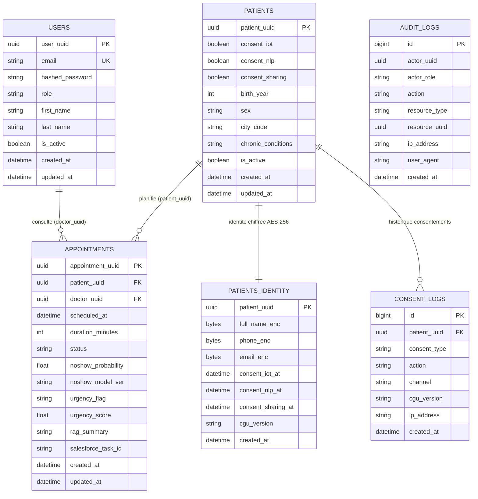
```mermaid
erDiagram
    USERS {
        uuid    user_uuid       PK
        string  email           UK
        string  hashed_password
        string  role
        string  first_name
        string  last_name
        boolean is_active
        datetime created_at
        datetime updated_at
    }

    PATIENTS {
        uuid    patient_uuid    PK
        boolean consent_iot
        boolean consent_nlp
        boolean consent_sharing
        int     birth_year
        string  sex
        string  city_code
        string  chronic_conditions
        boolean is_active
        datetime created_at
        datetime updated_at
    }

    PATIENTS_IDENTITY {
        uuid    patient_uuid    PK
        bytes   full_name_enc
        bytes   phone_enc
        bytes   email_enc
        datetime consent_iot_at
        datetime consent_nlp_at
        datetime consent_sharing_at
        string  cgu_version
        datetime created_at
    }

    CONSENT_LOGS {
        bigint  id              PK
        uuid    patient_uuid    FK
        string  consent_type
        string  action
        string  channel
        string  cgu_version
        string  ip_address
        datetime created_at
    }

    APPOINTMENTS {
        uuid    appointment_uuid PK
        uuid    patient_uuid     FK
        uuid    doctor_uuid      FK
        datetime scheduled_at
        int     duration_minutes
        string  status
        float   noshow_probability
        string  noshow_model_ver
        string  urgency_flag
        float   urgency_score
        string  rag_summary
        string  salesforce_task_id
        datetime created_at
        datetime updated_at
    }

    AUDIT_LOGS {
        bigint  id              PK
        uuid    actor_uuid
        string  actor_role
        string  action
        string  resource_type
        uuid    resource_uuid
        string  ip_address
        string  user_agent
        datetime created_at
    }

    USERS            ||--o{ APPOINTMENTS    : "consulte (doctor_uuid)"
    PATIENTS         ||--o{ APPOINTMENTS    : "planifie (patient_uuid)"
    PATIENTS         ||--||  PATIENTS_IDENTITY : "identite chiffree AES-256"
    PATIENTS         ||--o{ CONSENT_LOGS   : "historique consentements"
```

> **Remarques :**
> - `PATIENTS_IDENTITY` réside dans le schéma PostgreSQL **`secure`** (séparé de `public`) — accès restreint au niveau applicatif.
> - `AUDIT_LOGS` n'a **pas de FK** par conception (table immuable APPEND-ONLY) — `actor_uuid` référence logiquement `USERS` mais sans contrainte pour garantir l'immuabilité absolue.
> - `CONSENT_LOGS` est également immuable — règles PostgreSQL `DO INSTEAD NOTHING` sur UPDATE et DELETE.

---

## 4. Diagrammes de Séquence

### 4.1 Connexion — POST /auth/login

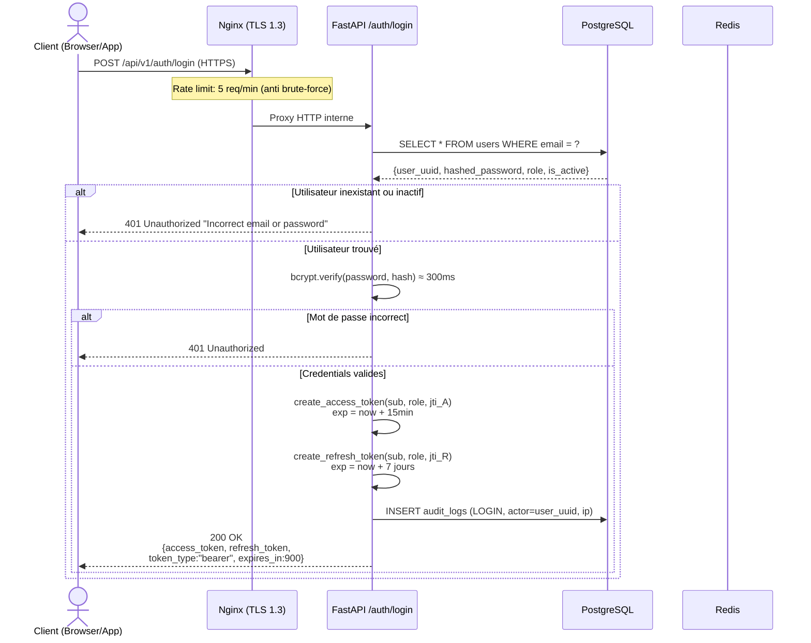
```mermaid
sequenceDiagram
    actor Client as Client (Browser/App)
    participant NGINX as Nginx (TLS 1.3)
    participant API as FastAPI /auth/login
    participant DB as PostgreSQL
    participant REDIS as Redis

    Client->>NGINX: POST /api/v1/auth/login (HTTPS)
    Note over NGINX: Rate limit: 5 req/min (anti brute-force)
    NGINX->>API: Proxy HTTP interne

    API->>DB: SELECT * FROM users WHERE email = ?
    DB-->>API: {user_uuid, hashed_password, role, is_active}

    alt Utilisateur inexistant ou inactif
        API-->>Client: 401 Unauthorized "Incorrect email or password"
    else Utilisateur trouvé
        API->>API: bcrypt.verify(password, hash) ≈ 300ms
        alt Mot de passe incorrect
            API-->>Client: 401 Unauthorized
        else Credentials valides
            API->>API: create_access_token(sub, role, jti_A)<br/>exp = now + 15min
            API->>API: create_refresh_token(sub, role, jti_R)<br/>exp = now + 7 jours
            API->>DB: INSERT audit_logs (LOGIN, actor=user_uuid, ip)
            API-->>Client: 200 OK<br/>{access_token, refresh_token,<br/>token_type:"bearer", expires_in:900}
        end
    end
```

---

### 4.2 Requête Protégée — Bearer Token + RBAC

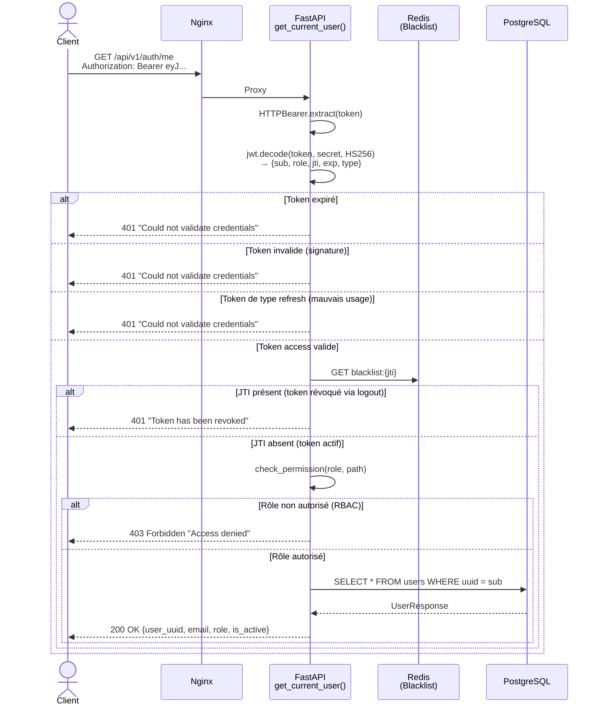
```mermaid
sequenceDiagram
    actor Client
    participant NGINX as Nginx
    participant API as FastAPI<br/>get_current_user()
    participant REDIS as Redis<br/>(Blacklist)
    participant DB as PostgreSQL

    Client->>NGINX: GET /api/v1/auth/me<br/>Authorization: Bearer eyJ...
    NGINX->>API: Proxy

    API->>API: HTTPBearer.extract(token)
    API->>API: jwt.decode(token, secret, HS256)<br/>→ {sub, role, jti, exp, type}

    alt Token expiré
        API-->>Client: 401 "Could not validate credentials"
    else Token invalide (signature)
        API-->>Client: 401 "Could not validate credentials"
    else Token de type refresh (mauvais usage)
        API-->>Client: 401 "Could not validate credentials"
    else Token access valide
        API->>REDIS: GET blacklist:{jti}
        alt JTI présent (token révoqué via logout)
            API-->>Client: 401 "Token has been revoked"
        else JTI absent (token actif)
            API->>API: check_permission(role, path)
            alt Rôle non autorisé (RBAC)
                API-->>Client: 403 Forbidden "Access denied"
            else Rôle autorisé
                API->>DB: SELECT * FROM users WHERE uuid = sub
                DB-->>API: UserResponse
                API-->>Client: 200 OK {user_uuid, email, role, is_active}
            end
        end
    end
```

---

### 4.3 Déconnexion — POST /auth/logout

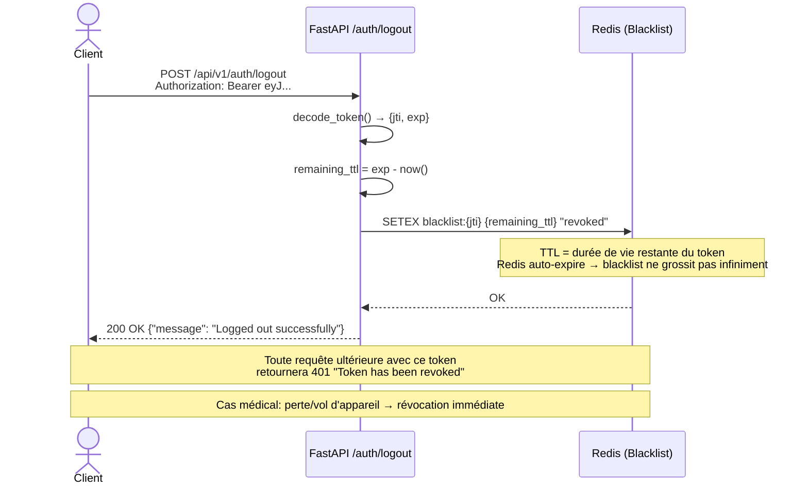
```mermaid
sequenceDiagram
    actor Client
    participant API as FastAPI /auth/logout
    participant REDIS as Redis (Blacklist)

    Client->>API: POST /api/v1/auth/logout<br/>Authorization: Bearer eyJ...

    API->>API: decode_token() → {jti, exp}
    API->>API: remaining_ttl = exp - now()

    API->>REDIS: SETEX blacklist:{jti} {remaining_ttl} "revoked"
    Note over REDIS: TTL = durée de vie restante du token<br/>Redis auto-expire → blacklist ne grossit pas infiniment

    REDIS-->>API: OK
    API-->>Client: 200 OK {"message": "Logged out successfully"}

    Note over Client,REDIS: Toute requête ultérieure avec ce token<br/>retournera 401 "Token has been revoked"
    Note over Client,REDIS: Cas médical: perte/vol d'appareil → révocation immédiate
```

---

### 4.4 Renouvellement — POST /auth/refresh

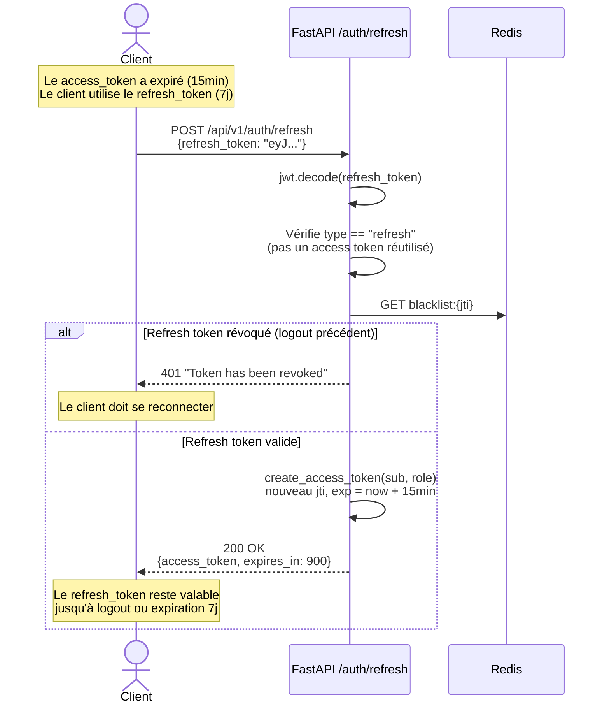
```mermaid
sequenceDiagram
    actor Client
    participant API as FastAPI /auth/refresh
    participant REDIS as Redis

    Note over Client: Le access_token a expiré (15min)<br/>Le client utilise le refresh_token (7j)

    Client->>API: POST /api/v1/auth/refresh<br/>{refresh_token: "eyJ..."}

    API->>API: jwt.decode(refresh_token)
    API->>API: Vérifie type == "refresh"<br/>(pas un access token réutilisé)
    API->>REDIS: GET blacklist:{jti}

    alt Refresh token révoqué (logout précédent)
        API-->>Client: 401 "Token has been revoked"
        Note over Client: Le client doit se reconnecter
    else Refresh token valide
        API->>API: create_access_token(sub, role)<br/>nouveau jti, exp = now + 15min
        API-->>Client: 200 OK<br/>{access_token, expires_in: 900}
        Note over Client: Le refresh_token reste valable<br/>jusqu'à logout ou expiration 7j
    end
```

---

### 4.5 Pipeline RAG — Chatbot Médical

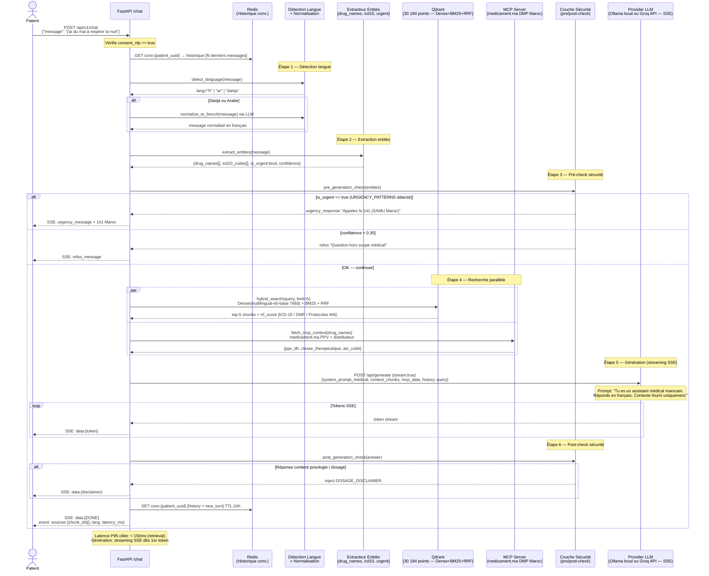
```mermaid
sequenceDiagram
    actor Patient
    participant API as FastAPI /chat
    participant REDIS as Redis<br/>(Historique conv.)
    participant LANG as Détection Langue<br/>+ Normalisation
    participant NLP as Extracteur Entités<br/>(drug_names, icd10, urgent)
    participant QDR as Qdrant<br/>(30 184 points — Dense+BM25+RRF)
    participant MCP as MCP Server<br/>(medicament.ma DMP Maroc)
    participant SAFE as Couche Sécurité<br/>(pre/post-check)
    participant LLM as Provider LLM<br/>(Ollama local ou Groq API — SSE)

    Patient->>API: POST /api/v1/chat<br/>{"message": "j'ai du mal à respirer la nuit"}
    Note over API: Vérifie consent_nlp == true

    API->>REDIS: GET conv:{patient_uuid} → historique [N derniers messages]

    Note over LANG: Étape 1 — Détection langue
    API->>LANG: detect_language(message)
    LANG-->>API: lang="fr" | "ar" | "darija"
    alt Darija ou Arabe
        API->>LANG: normalize_to_french(message) via LLM
        LANG-->>API: message normalisé en français
    end

    Note over NLP: Étape 2 — Extraction entités
    API->>NLP: extract_entities(message)
    NLP-->>API: {drug_names[], icd10_codes[], is_urgent:bool, confidence}

    Note over SAFE: Étape 3 — Pré-check sécurité
    API->>SAFE: pre_generation_check(entities)
    alt is_urgent == true (URGENCY_PATTERNS détecté)
        SAFE-->>API: urgency_response "Appelez le 141 (SAMU Maroc)"
        API-->>Patient: SSE: urgency_message + 141 Maroc
    else confidence < 0.30
        SAFE-->>API: refus "Question hors scope médical"
        API-->>Patient: SSE: refus_message
    else OK — continuer
        Note over QDR,MCP: Étape 4 — Recherche parallèle
        par
            API->>QDR: hybrid_search(query, limit=5)<br/>Dense(multilingual-e5-base 768d) + BM25 + RRF
            QDR-->>API: top-5 chunks + rrf_score [ICD-10 / DMP / Protocoles MA]
        and
            API->>MCP: fetch_mcp_context(drug_names)<br/>medicament.ma PPV + distributeur
            MCP-->>API: {ppv_dh, classe_therapeutique, atc_code}
        end

        Note over LLM: Étape 5 — Génération (streaming SSE)
        API->>LLM: POST /api/generate (stream:true)<br/>{system_prompt_médical, context_chunks, mcp_data, history, query}
        Note over LLM: Prompt: "Tu es un assistant médical marocain.<br/>Réponds en français. Contexte fourni uniquement."
        loop Tokens SSE
            LLM-->>API: token stream
            API-->>Patient: SSE: data:{token}
        end

        Note over SAFE: Étape 6 — Post-check sécurité
        API->>SAFE: post_generation_check(answer)
        alt Réponse contient posologie / dosage
            SAFE-->>API: inject DOSAGE_DISCLAIMER
            API-->>Patient: SSE: data:{disclaimer}
        end

        API->>REDIS: SET conv:{patient_uuid} [history + new_turn] TTL:24h
        API-->>Patient: SSE: data:[DONE]<br/>event: sources {chunk_ids[], lang, latency_ms}
    end
    Note over API: Latence P95 cible: < 150ms (retrieval)<br/>Génération: streaming SSE dès 1er token
```

---

### 4.6 Pipeline IoT — Détection d'Anomalie LSTM

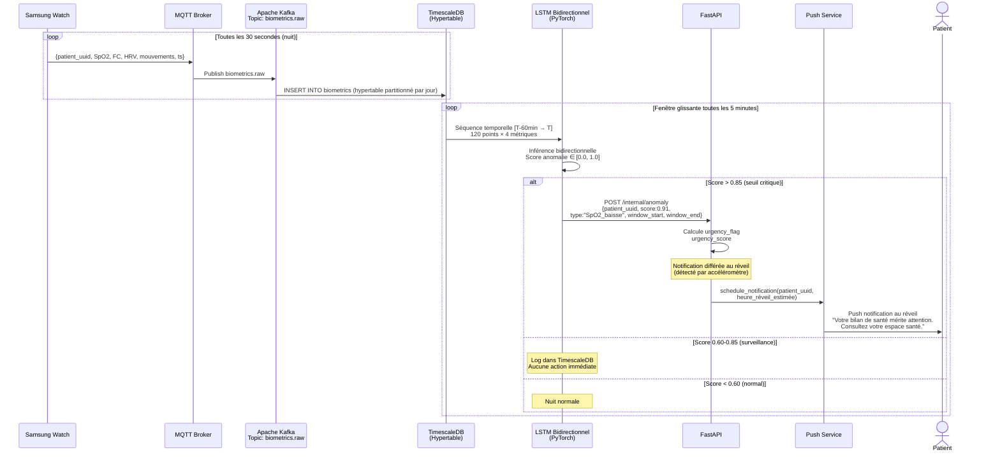
```mermaid
sequenceDiagram
    participant WATCH as Samsung Watch
    participant MQTT as MQTT Broker
    participant KAFKA as Apache Kafka<br/>Topic: biometrics.raw
    participant TS as TimescaleDB<br/>(Hypertable)
    participant LSTM as LSTM Bidirectionnel<br/>(PyTorch)
    participant API as FastAPI
    participant PUSH as Push Service
    actor Patient

    loop Toutes les 30 secondes (nuit)
        WATCH->>MQTT: {patient_uuid, SpO2, FC, HRV, mouvements, ts}
        MQTT->>KAFKA: Publish biometrics.raw
        KAFKA->>TS: INSERT INTO biometrics (hypertable partitionné par jour)
    end

    loop Fenêtre glissante toutes les 5 minutes
        TS->>LSTM: Séquence temporelle [T-60min → T]<br/>120 points × 4 métriques
        LSTM->>LSTM: Inférence bidirectionnelle<br/>Score anomalie ∈ [0.0, 1.0]

        alt Score > 0.85 (seuil critique)
            LSTM->>API: POST /internal/anomaly<br/>{patient_uuid, score:0.91,<br/>type:"SpO2_baisse", window_start, window_end}
            API->>API: Calcule urgency_flag<br/>urgency_score
            Note over API: Notification différée au réveil<br/>(détecté par accéléromètre)
            API->>PUSH: schedule_notification(patient_uuid,<br/>heure_réveil_estimée)
            PUSH->>Patient: Push notification au réveil<br/>"Votre bilan de santé mérite attention.<br/>Consultez votre espace santé."
        else Score 0.60-0.85 (surveillance)
            Note over LSTM: Log dans TimescaleDB<br/>Aucune action immédiate
        else Score < 0.60 (normal)
            Note over LSTM: Nuit normale
        end
    end
```

---

### 4.7 Pipeline ML — Prédiction No-Show

```mermaid
sequenceDiagram
    participant SEC as Secrétaire
    participant API as FastAPI<br/>/appointments
    participant FE as Feature Engineering
    participant XGB as XGBoost Model<br/>(MLflow v2.1)
    participant MLFLOW as MLflow Registry
    participant AGENDA as Agenda Service
    participant SF as Salesforce CRM

    Note over MLFLOW: Modèle chargé en mémoire au démarrage

    SEC->>API: POST /api/v1/appointments<br/>{patient_uuid, doctor_uuid, scheduled_at}

    API->>FE: Prépare features patient<br/>{distance_clinique, nb_annulations_passées,<br/>jour_semaine, heure_rdv, météo_prévue,<br/>chronic_conditions count, age_approx, consent_iot}
    FE-->>API: feature_vector [8 dims]

    API->>XGB: predict_proba(feature_vector)
    XGB-->>API: {noshow_prob: 0.73, shap_values[8], model_version:"v2.1"}

    alt prob > 0.70 — Risque Élevé
        API->>AGENDA: Marque RDV RISQUE_ÉLEVÉ<br/>(couleur rouge)
        API->>SF: POST /services/data/tasks<br/>{subject:"Confirmer RDV — Risque No-Show",<br/>assignee:secretary, due:J-2}
        SF-->>API: {salesforce_task_id: "00T..."}
    else prob 0.40-0.70 — Risque Modéré
        API->>AGENDA: Marque RDV RISQUE_MODÉRÉ<br/>(couleur orange)
    else prob ≤ 0.40 — Faible Risque
        API->>AGENDA: RDV standard (couleur verte)
    end

    API->>API: UPDATE appointments SET<br/>noshow_probability, salesforce_task_id,<br/>noshow_model_ver
    API-->>SEC: 201 Created<br/>{appointment_uuid, noshow_probability, risk_level}
    Note over API: Latence totale cible: < 200ms
```

---

### 4.8 RGPD — Gestion du Consentement et Export

```mermaid
sequenceDiagram
    actor Patient
    participant API as FastAPI /patient
    participant DB as PostgreSQL
    participant QDRANT as Qdrant<br/>(Vecteurs médicaux)

    Note over Patient,DB: Enregistrement initial du consentement

    Patient->>API: POST /api/v1/patient/consent<br/>{iot:true, nlp:true, sharing:false}
    API->>DB: UPDATE patients SET consent_iot=true, consent_nlp=true
    API->>DB: INSERT consent_logs (iot, granted, channel='app', cgu_v1.0)
    API->>DB: INSERT consent_logs (nlp, granted, channel='app', cgu_v1.0)
    DB-->>API: OK
    API-->>Patient: 200 OK {consents_updated: ["iot","nlp"]}

    Note over Patient,QDRANT: Révocation du consentement NLP (Art.17 RGPD)

    Patient->>API: POST /api/v1/patient/consent<br/>{nlp:false}
    API->>DB: UPDATE patients SET consent_nlp=false
    API->>DB: INSERT consent_logs (nlp, revoked, channel='app')
    API->>QDRANT: DELETE /collections/medical/points<br/>?filter={patient_uuid: "..."}
    Note over QDRANT: Suppression des embeddings<br/>→ plus de RAG pour ce patient
    QDRANT-->>API: {deleted: 247 vectors}
    API-->>Patient: 200 OK

    Note over Patient,DB: Export des données (Art.15 RGPD)

    Patient->>API: GET /api/v1/patient/data/export
    API->>DB: SELECT * FROM patients WHERE uuid = ?
    API->>DB: SELECT pgp_sym_decrypt(full_name_enc, key) FROM secure.patients_identity
    API->>DB: SELECT * FROM appointments WHERE patient_uuid = ?
    API->>DB: SELECT * FROM consent_logs WHERE patient_uuid = ?
    DB-->>API: Toutes les données du patient
    API->>DB: INSERT audit_logs (EXPORT, actor=patient_uuid)
    API-->>Patient: 200 OK application/json<br/>{profile, identity_decrypted,<br/>appointments[], consent_history[]}
```

---

## 5. Flux Métier

### 5.1 Parcours Patient Complet — 24 heures

```mermaid
flowchart TD
    A["🌙 22h00 — Patient endormi<br/>Samsung Watch activée"]
    B["Capteurs toutes 30s<br/>SpO2 + FC + HRV + mouvements"]
    C["MQTT → Kafka → TimescaleDB<br/>Série temporelle persistée"]
    D{"LSTM Bidirectionnel<br/>Score anomalie > 0.85?"}
    E["⚠️ Anomalie détectée<br/>Ex: SpO2 < 92%, FC irrégulière"]
    F["🌅 Réveil détecté — 7h15<br/>(accéléromètre: fin d'immobilité)"]
    G["📱 Push notification<br/>'Votre bilan mérite attention'"]
    H["Patient ouvre l'app<br/>→ Chatbot RAG démarre"]
    I["Triage cognitif NLP<br/>Questions: durée, intensité, contexte"]
    J["RAG: Qdrant hybrid (30 184 pts) → provider LLM (Ollama/Groq)<br/>Réponse contextualisée FR/AR/Darija + 141 SAMU si urgent"]
    K["Score urgence calculé<br/>urgency_flag: ANOMALIE_IOT_ESSOUFFLEMENT<br/>urgency_score: 0.82"]
    L["XGBoost: Prédiction No-Show<br/>Prob: 0.73 → RISQUE ÉLEVÉ"]
    M["📅 RDV créé automatiquement<br/>10h30 — Dr. Benali<br/>Durée: 20min"]
    N["Salesforce: Tâche créée<br/>Secrétaire notifiée J-2"]
    O["📲 SMS de confirmation<br/>9h00"]
    P["🏥 10h30 — Consultation<br/>Dr. Benali reçoit résumé IA"]
    Q["Résumé DPA 3 colonnes:<br/>Symptômes | Contexte IoT | Actions<br/>⏱️ 11 min économisées / consultation"]
    R["CRM Salesforce mis à jour<br/>Suivi post-consultation planifié"]

    A --> B --> C --> D
    D -->|Non| B
    D -->|Oui| E --> F --> G --> H
    H --> I --> J --> K --> L --> M
    M --> N & O
    N & O --> P --> Q --> R
```

---

### 5.2 Flux de Consultation Médicale Augmentée

```mermaid
flowchart LR
    subgraph AVANT["Avant la Consultation"]
        A1["Données IoT nuit<br/>(Samsung Watch)"]
        A2["Historique RDV<br/>No-show passés"]
        A3["Consentements RGPD<br/>validés"]
        A4["Score No-Show<br/>XGBoost: 0.73"]
        A5["Confirmation<br/>Secrétaire / SMS"]
    end

    subgraph PENDANT["Pendant la Consultation"]
        B1["Résumé DPA affiché<br/>(3 colonnes)"]
        B2["Col. 1: Symptômes<br/>(RAG Chatbot)"]
        B3["Col. 2: Contexte IoT<br/>(LSTM anomalies)"]
        B4["Col. 3: Actions<br/>(suggestions IA)"]
        B5["Médecin valide /<br/>modifie le résumé<br/>(Human-in-the-Loop)"]
    end

    subgraph APRES["Après la Consultation"]
        C1["Compte-rendu sauvé<br/>PostgreSQL"]
        C2["Audit log créé<br/>RGPD Art.30"]
        C3["Salesforce mis à jour<br/>Tâche de suivi"]
        C4["Prochain RDV<br/>pré-calculé"]
    end

    A1 & A2 & A3 --> A4
    A4 --> A5 --> B1
    B1 --> B2 & B3 & B4
    B2 & B3 & B4 --> B5
    B5 --> C1 & C2 & C3 & C4
```

---

### 5.3 Pipeline MLOps — Réentraînement Automatique

```mermaid
flowchart TB
    subgraph PROD["Production"]
        MODEL["XGBoost v2.1<br/>F1=0.84 | AUC=0.89<br/>(modèle actif)"]
    end

    subgraph MONITOR["Surveillance Continue — Evidently AI"]
        EVID["Rapport dérive<br/>hebdomadaire"]
        DRIFT_CHECK{"Dérive détectée?<br/>F1 < 0.80 ou<br/>Data drift PSI > 0.2"}
    end

    subgraph RETRAIN["Réentraînement — DAG Airflow"]
        DATA_COL["Collecte nouvelles données<br/>4 dernières semaines"]
        SMOTE["SMOTE<br/>Rééquilibrage classes"]
        TRAIN_ALL["Entraîne 3 modèles:<br/>XGBoost | LightGBM | CatBoost"]
        EVAL["Évaluation: F1, AUC-ROC,<br/>Précision, Rappel, SHAP"]
        COMPARE{"Meilleur F1 ><br/>Modèle actuel + 1%?"}
    end

    subgraph REGISTRY["MLflow Model Registry"]
        REG["Enregistre nouveau modèle<br/>+ métriques + artefacts SHAP"]
        STAGING["Stage: Staging<br/>→ Tests A/B"]
        PROMOTION["Promotion: Production<br/>(remplacement automatique)"]
    end

    ROLLBACK["🚨 Auto-rollback<br/>Version précédente restaurée<br/>(si F1 chute > 10%)"]

    MODEL --> EVID --> DRIFT_CHECK
    DRIFT_CHECK -->|Oui| DATA_COL
    DRIFT_CHECK -->|Non — surveillance continue| EVID

    DATA_COL --> SMOTE --> TRAIN_ALL --> EVAL --> COMPARE
    COMPARE -->|Oui| REG --> STAGING --> PROMOTION --> MODEL
    COMPARE -->|Non — ancien modèle gardé| MODEL
    EVAL -->|"F1 < 0.74 (chute brutale)"| ROLLBACK --> MODEL
```

---

## 6. Architecture des Pipelines IA

### 6.1 Pipeline 1 — IoT & LSTM Bidirectionnel

```mermaid
flowchart LR
    subgraph EDGE["Edge — Appareil Patient"]
        SW["Samsung Watch<br/>OS: Tizen/WearOS"]
        BLE["BLE / WiFi"]
    end

    subgraph INGESTION["Ingestion Temps Réel"]
        MQTT["MQTT Broker<br/>QoS Level 1"]
        KAFKA["Apache Kafka<br/>Topic: biometrics.raw<br/>Retention: 7j"]
        CONSUMER["Kafka Consumer<br/>(Python async)"]
    end

    subgraph STOCKAGE["Stockage Série Temporelle"]
        TS["TimescaleDB<br/>(PostgreSQL extension)<br/>Hypertable: biometrics<br/>Compression automatique<br/>Rétention: 30 jours"]
    end

    subgraph ML["Inférence LSTM"]
        WINDOW["Fenêtre glissante<br/>120 points × 4 métriques<br/>(60min, toutes les 5min)"]
        PREPROC["Normalisation<br/>MinMaxScaler"]
        LSTM_M["LSTM Bidirectionnel<br/>(PyTorch)<br/>2 couches × 128 units<br/>Dropout 0.3"]
        SCORE["Score anomalie<br/>∈ [0.0, 1.0]"]
    end

    subgraph ACTION["Actions"]
        LOG["Log TimescaleDB<br/>(toutes les inférences)"]
        ALERT["Alerte API FastAPI<br/>(score > 0.85)"]
        NOTIF["Push Notification<br/>(réveil patient)"]
    end

    SW -->|"SpO2, FC, HRV, accél."| BLE --> MQTT
    MQTT --> KAFKA --> CONSUMER
    CONSUMER --> TS
    TS --> WINDOW --> PREPROC --> LSTM_M --> SCORE
    SCORE --> LOG
    SCORE -->|"> 0.85"| ALERT --> NOTIF
```

---

### 6.2 Pipeline 2 — RAG & Provider LLM (Ollama/Groq)

```mermaid
flowchart TB
    subgraph CORPUS["Corpus Médical — Indexation Offline"]
        D1["ICD-10 (CIM-10)<br/>12 243 codes diagnostics"]
        D2["DMP Maroc (medicament.ma)<br/>5 019 médicaments A-Z<br/>PPV dhs + distributeur"]
        D3["Protocoles marocains<br/>AMO / RAMED / PNLT / PNLS<br/>94 chunks guideline"]
        CHUNK["Chunking adaptatif<br/>512 tokens, overlap 64"]
        EMBED["Embedding<br/>multilingual-e5-base<br/>(768 dims — FR/AR/Darija)"]
        BM25_I["Index BM25<br/>(keyword sparse)"]
        DENSE_I["Index Dense HNSW<br/>(Qdrant on_disk=True)"]
    end

    subgraph QUERY["Requête Patient — Runtime"]
        MSG["Message patient<br/>(FR / AR / Darija)"]
        LANGDET["Détection langue<br/>+ normalisation français"]
        ENTITY["Extraction entités<br/>drug_names / ICD10 / is_urgent"]
        QEMBED["Embedding requête<br/>prefix: 'query: ' (E5 asymmetric)"]
        HYBRIDS["Hybrid Search<br/>Dense + BM25 → RRF fusion<br/>top-5 chunks"]
        MCPCTX["MCP Context<br/>medicament.ma<br/>ppv_dh + classe ATC"]
        SAFETY_PRE["Pré-check sécurité<br/>URGENCY → 141 SAMU Maroc<br/>confidence < 0.30 → refuse"]
        CONTEXT["Contexte assemblé<br/>(5 chunks + MCP + historique Redis)"]
        PROMPT["Prompt médical marocain<br/>FR-only output<br/>no diagnostic définitif"]
        LLAMA_M["Provider LLM<br/>(Ollama local ou Groq)<br/>streaming SSE"]
        SAFETY_POST["Post-check<br/>injection DOSAGE_DISCLAIMER<br/>si posologie détectée"]
        RESPONSE["Réponse SSE<br/>+ sources + disclaimer + lang"]
    end

    D1 & D2 & D3 --> CHUNK --> EMBED
    EMBED --> DENSE_I
    CHUNK --> BM25_I

    MSG --> LANGDET --> ENTITY --> QEMBED
    QEMBED --> HYBRIDS
    DENSE_I & BM25_I --> HYBRIDS
    ENTITY --> MCPCTX
    HYBRIDS & MCPCTX --> SAFETY_PRE
    SAFETY_PRE -->|"OK"| CONTEXT
    CONTEXT --> PROMPT --> LLAMA_M --> SAFETY_POST --> RESPONSE
```

---

### 6.3 Pipeline 3 — XGBoost No-Show

```mermaid
flowchart LR
    subgraph FEATURES["Feature Engineering"]
        F1["distance_clinique<br/>(km, approx.)"]
        F2["nb_annulations_12m<br/>(historique RDV)"]
        F3["jour_semaine<br/>(0=Lundi ... 6=Dim)"]
        F4["heure_rdv<br/>(0-23h)"]
        F5["meteo_prevue<br/>(pluie: 1 / soleil: 0)"]
        F6["nb_maladies_chroniques<br/>(len(chronic_conditions))"]
        F7["age_approx<br/>(2026 - birth_year)"]
        F8["consent_iot<br/>(IoT actif: 1 / non: 0)"]
    end

    subgraph MODEL["Modèle XGBoost"]
        XGBM["XGBoost Classifier<br/>max_depth=6, n_estimators=500<br/>scale_pos_weight=3.2<br/>(données déséquilibrées)"]
        SHAP_V["SHAP Values<br/>Explication par feature"]
        PROB["noshow_probability<br/>∈ [0.0, 1.0]"]
    end

    subgraph DECISION["Décision Agenda"]
        D1["prob > 0.70<br/>🔴 RISQUE ÉLEVÉ<br/>→ Tâche Salesforce"]
        D2["prob 0.40-0.70<br/>🟠 RISQUE MODÉRÉ<br/>→ Rappel SMS J-1"]
        D3["prob ≤ 0.40<br/>🟢 FAIBLE RISQUE<br/>→ RDV standard"]
    end

    F1 & F2 & F3 & F4 & F5 & F6 & F7 & F8 --> XGBM
    XGBM --> PROB & SHAP_V
    PROB --> D1 & D2 & D3
```

---

### 6.4 Intégration CRM Salesforce

```mermaid
sequenceDiagram
    participant API as FastAPI
    participant SF as Salesforce CRM<br/>(Apex REST)
    participant SEC as Secrétaire

    Note over API,SF: Déclenchée par: RDV à risque élevé OU consultation terminée

    API->>SF: POST /services/apexrest/medisense/tasks<br/>Authorization: Bearer {sf_oauth_token}<br/>{subject, assignee_email, due_date,<br/>patient_ref, priority:"High",<br/>description:"No-show prob: 73%"}

    SF-->>API: 201 Created {salesforce_task_id: "00T5e..."}

    API->>API: UPDATE appointments SET salesforce_task_id

    SF->>SEC: Notification Salesforce<br/>"Nouvelle tâche: Confirmer RDV — Risque No-Show"

    SEC->>SF: Marque tâche "Complétée"<br/>(après appel de confirmation)

    SF->>API: Webhook POST /webhooks/salesforce<br/>{task_id, status:"Completed", confirmed:true}

    API->>API: UPDATE appointments SET status="confirmed"
    API->>API: INSERT audit_logs (APPOINTMENT_CONFIRMED)
```

---

## 7. Sécurité & RGPD

### 7.1 Architecture de Sécurité par Couches

```mermaid
flowchart TB
    INTERNET["Internet"] --> L1

    subgraph L1["Couche 1 — Transport"]
        TLS["TLS 1.3 (Nginx)<br/>HSTS 1 an<br/>HTTP → HTTPS redirect<br/>ssl_protocols TLSv1.3"]
    end

    L1 --> L2

    subgraph L2["Couche 2 — Périmètre"]
        RATE["Rate Limiting (Nginx)<br/>5 req/min /auth/login<br/>60 req/min /api/"]
        HEADERS["Security Headers<br/>X-Frame-Options: DENY<br/>X-Content-Type-Options: nosniff<br/>CSP strict (api) / relaxed (docs)"]
    end

    L2 --> L3

    subgraph L3["Couche 3 — Authentification"]
        JWT_L["JWT HS256<br/>access: 15min | refresh: 7j"]
        BCRYPT["bcrypt rounds=12<br/>~300ms/hash"]
        BLACKLIST["Redis Blacklist<br/>Révocation instantanée<br/>TTL auto-expiry"]
    end

    L3 --> L4

    subgraph L4["Couche 4 — Autorisation RBAC"]
        RBAC_L["Dependency Injection<br/>require_role(doctor)<br/>require_role(admin)<br/>→ 403 si non autorisé"]
    end

    L4 --> L5

    subgraph L5["Couche 5 — Données"]
        PSEUDO["Pseudonymisation<br/>UUID-only dans public.*"]
        AES["AES-256 pgcrypto<br/>Identité civile chiffrée<br/>(secure.patients_identity)"]
        AUDIT["Audit Log Immuable<br/>Chaque accès enregistré<br/>(Art. 30 RGPD)"]
    end
```

---

### 7.2 Modèle RBAC — Contrôle d'Accès par Rôle

```mermaid
flowchart LR
    subgraph ROLES["Rôles Système"]
        ADM["👨‍💼 admin"]
        DOC["👨‍⚕️ doctor"]
        SEC_R["👩‍💼 secretary"]
        PAT["🧑 patient"]
    end

    subgraph PERMS["Permissions Endpoints"]
        P1["/api/v1/admin/*<br/>Gestion utilisateurs, audit"]
        P2["/api/v1/patients/*<br/>Dossiers patients complets"]
        P3["/api/v1/appointments/*<br/>Gestion rendez-vous"]
        P4["/api/v1/users/*<br/>CRUD utilisateurs staff"]
        P5["/api/v1/dpa/*<br/>Résumé IA médecin"]
        P6["/api/v1/alerts/*<br/>Alertes IoT"]
        P7["/api/v1/agenda/*<br/>Agenda secrétaire"]
        P8["/api/v1/patient/*<br/>Données propres patient"]
        P9["/api/v1/chat/*<br/>Chatbot RAG"]
        P10["/api/v1/health<br/>Santé services"]
    end

    ADM --> P1 & P2 & P3 & P4 & P10
    DOC --> P2 & P3 & P5 & P6 & P10
    SEC_R --> P3 & P7 & P10
    PAT --> P8 & P9 & P10
```

---

### 7.3 Privacy by Design — Flux RGPD

```mermaid
flowchart TB
    subgraph PRINCIPES["Principes Art. 25 RGPD — Privacy by Design"]
        direction LR
        P1["Minimisation<br/>des données"]
        P2["Pseudonymisation<br/>dès la collecte"]
        P3["Chiffrement<br/>at-rest & in-transit"]
        P4["Consentement<br/>granulaire"]
        P5["Traçabilité<br/>immutable"]
    end

    subgraph IMPL["Implémentation Technique"]
        I1["birth_year seul<br/>(pas date complète)<br/>city_code seul<br/>(pas adresse)"]
        I2["UUID unique<br/>dans public.*<br/>Aucune identité civile"]
        I3["TLS 1.3 (transit)<br/>AES-256 pgcrypto (repos)<br/>bcrypt passwords"]
        I4["3 opt-ins séparés:<br/>✅ IoT biométrique<br/>✅ NLP chatbot<br/>✅ Partage médecin"]
        I5["audit_logs immuable<br/>consent_logs immuable<br/>PostgreSQL RULE"]
    end

    subgraph DROITS["Droits Patients — RGPD"]
        D1["Art. 15 — Accès<br/>GET /patient/data/export"]
        D2["Art. 16 — Rectification<br/>PUT /patient/profile"]
        D3["Art. 17 — Effacement<br/>DELETE /patient/{uuid}<br/>+ DELETE Qdrant vectors"]
        D4["Art. 20 — Portabilité<br/>export JSON structuré"]
        D5["Art. 7 — Consentement<br/>POST /patient/consent<br/>Révocable à tout moment"]
    end

    P1 --> I1
    P2 --> I2
    P3 --> I3
    P4 --> I4
    P5 --> I5

    I4 --> D5
    I1 & I2 --> D1 & D4
    I2 --> D3
```

---

## Résumé des Diagrammes par Section du Rapport PFE

| Section Rapport | Diagramme | Numéro |
|----------------|-----------|--------|
| **Contexte & Architecture** | Vue d'ensemble 3 pipelines | 1.1 |
| **Contexte & Architecture** | Infrastructure Docker | 1.2 |
| **Contexte & Architecture** | Composants Backend | 1.3 |
| **Analyse des Besoins** | UC Global | 2.1 |
| **Analyse des Besoins** | UC Sprint 1 — Fondation | 2.2 |
| **Analyse des Besoins** | UC Sprint 2 — RGPD | 2.3 |
| **Analyse des Besoins** | UC Sprint 3 — RAG/LLM | 2.4 |
| **Analyse des Besoins** | UC Sprint 4 — Agents & DPA | 2.5 |
| **Analyse des Besoins** | UC Sprint 5 — ML No-Show | 2.6 |
| **Analyse des Besoins** | UC Sprint 6 — Salesforce & MLOps | 2.7 |
| **Analyse des Besoins** | UC Sprint 7 — IoT/LSTM | 2.8 |
| **Analyse des Besoins** | UC Sprint 8 — Intégration & Production | 2.9 |
| **Conception Statique** | Diagramme de Classes | 3.1 |
| **Conception Statique** | ERD Base de données | 3.2 |
| **Conception Dynamique** | Séquence Authentification (x4) | 4.1–4.4 |
| **Conception Dynamique** | Séquence RAG Chatbot | 4.5 |
| **Conception Dynamique** | Séquence IoT/LSTM | 4.6 |
| **Conception Dynamique** | Séquence No-Show ML | 4.7 |
| **Conception Dynamique** | Séquence RGPD Consentement | 4.8 |
| **Flux Métier** | Parcours patient 24h | 5.1 |
| **Flux Métier** | Consultation augmentée | 5.2 |
| **Flux Métier** | MLOps réentraînement | 5.3 |
| **Pipelines IA** | IoT + LSTM détail | 6.1 |
| **Pipelines IA** | RAG + Provider LLM (Ollama/Groq) détail | 6.2 |
| **Pipelines IA** | XGBoost No-Show détail | 6.3 |
| **Pipelines IA** | Intégration Salesforce | 6.4 |
| **Sécurité** | Architecture sécurité couches | 7.1 |
| **Sécurité** | Modèle RBAC | 7.2 |
| **Sécurité** | Privacy by Design RGPD | 7.3 |

**Total : 28 diagrammes** couvrant l'ensemble des 10 sprints du rapport PFE.
